# Eclipse Cargo Tracker - DDD Architecture Diagram

## Overview

This document provides a comprehensive architectural view of the Eclipse Cargo Tracker application, showing the four DDD bounded contexts, their key classes, and interactions.

---

## High-Level Architecture

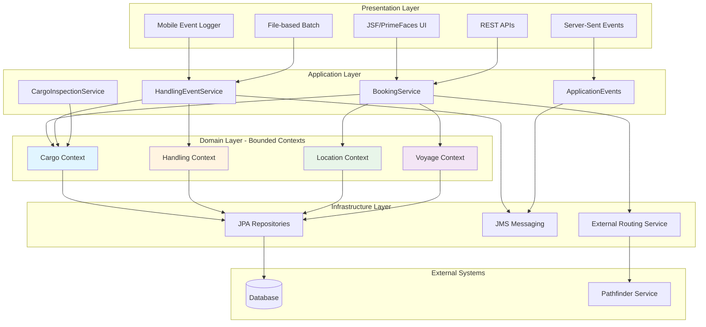

---

## Bounded Context: Cargo

The Cargo bounded context manages the lifecycle and routing of cargo shipments.

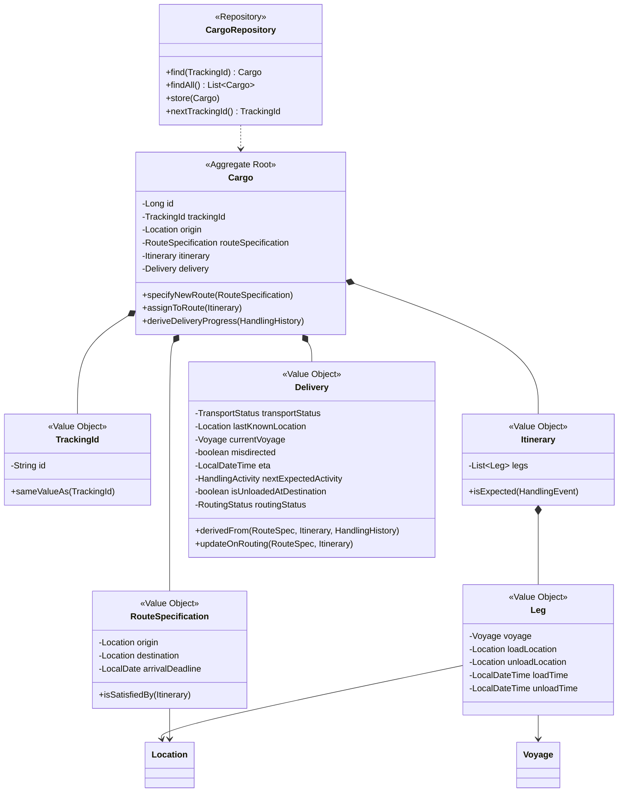

**Key Responsibilities:**
- Track cargo from booking to delivery
- Manage routing and re-routing
- Calculate delivery status and ETA
- Detect misdirection

---

## Bounded Context: Handling

The Handling bounded context tracks physical handling events of cargo.

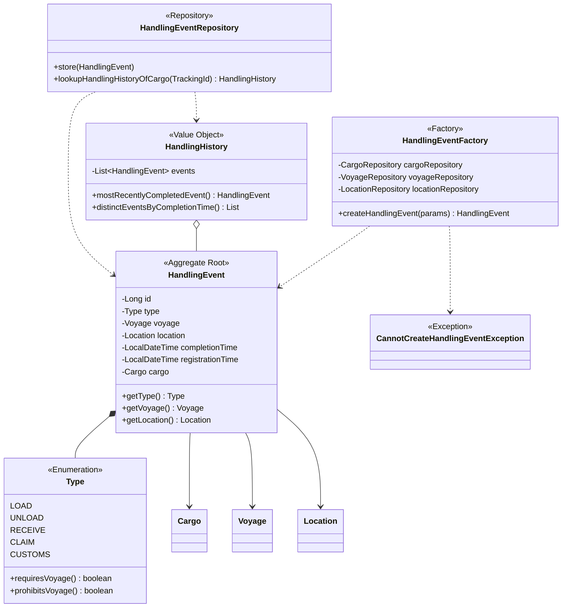

**Key Responsibilities:**
- Register handling events (load, unload, receive, claim, customs)
- Validate event consistency
- Maintain handling history
- Trigger cargo inspection on events

---

## Bounded Context: Location

The Location bounded context manages geographical locations where cargo operations occur.

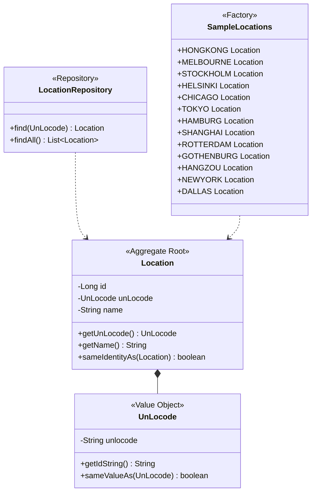

**Key Responsibilities:**
- Identify locations by UN/LOCODE
- Provide reference data for ports and warehouses
- Support location-based queries

---

## Bounded Context: Voyage

The Voyage bounded context represents carrier movements and schedules.

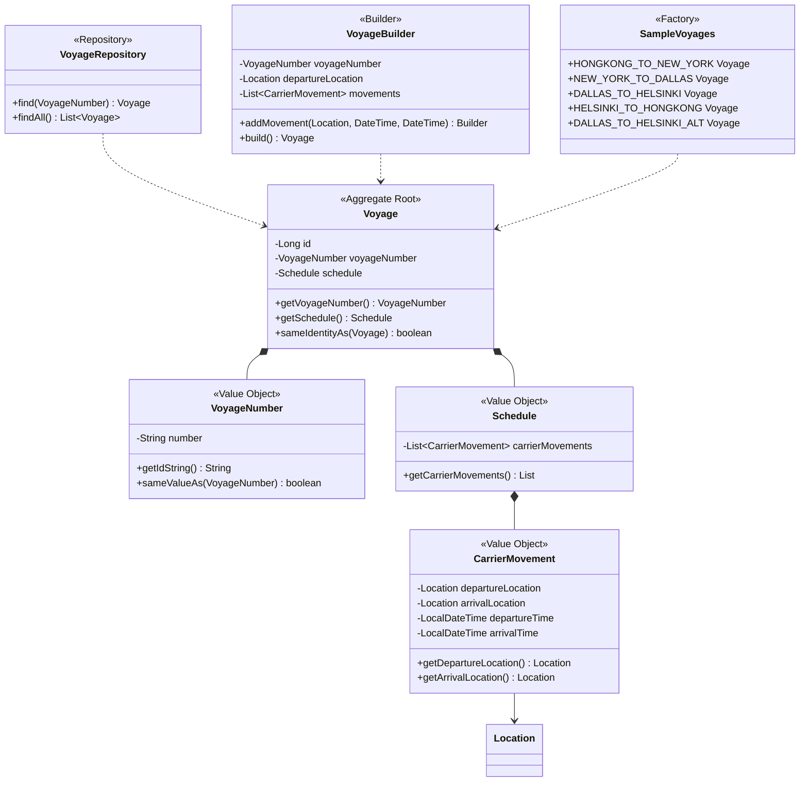

**Key Responsibilities:**
- Define carrier movement schedules
- Track voyage routes and timing
- Support itinerary planning
- Provide reference data for active voyages

---

## Application Services Layer

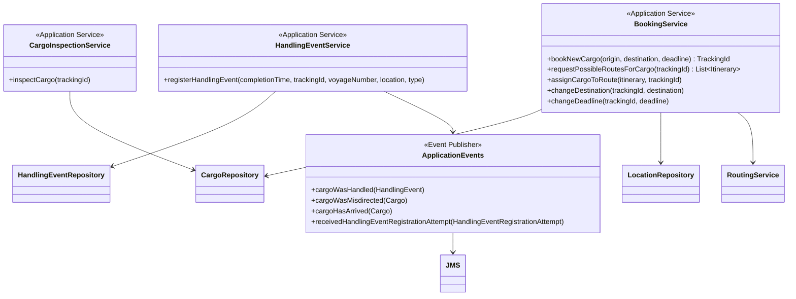

---

## Infrastructure Layer

```mermaid
classDiagram
    class JpaCargoRepository {
        <<Repository Implementation>>
        -EntityManager entityManager
        -Event~Cargo~ cargoUpdated
        +find(TrackingId) Cargo
        +findAll() List~Cargo~
        +store(Cargo)
        +nextTrackingId() TrackingId
    }

    class JpaHandlingEventRepository {
        <<Repository Implementation>>
        -EntityManager entityManager
        +store(HandlingEvent)
        +lookupHandlingHistoryOfCargo(TrackingId) HandlingHistory
    }

    class JpaLocationRepository {
        <<Repository Implementation>>
        -EntityManager entityManager
        +find(UnLocode) Location
        +findAll() List~Location~
    }

    class JpaVoyageRepository {
        <<Repository Implementation>>
        -EntityManager entityManager
        +find(VoyageNumber) Voyage
        +findAll() List~Voyage~
    }

    class ExternalRoutingService {
        <<Domain Service Implementation>>
        -WebTarget graphTraversalResource
        -LocationRepository locationRepository
        -VoyageRepository voyageRepository
        +fetchRoutesForSpecification(RouteSpec) List~Itinerary~
    }

    class JmsApplicationEvents {
        <<Event Publisher Implementation>>
        -JMSContext jmsContext
        -Queue cargoHandledQueue
        -Queue misdirectedCargoQueue
        -Queue deliveredCargoQueue
        -Queue rejectedRegistrationAttemptsQueue
        -Queue handlingEventRegistrationAttemptQueue
        +cargoWasHandled(HandlingEvent)
        +cargoWasMisdirected(Cargo)
        +cargoHasArrived(Cargo)
    }

    JpaCargoRepository ..|> CargoRepository
    JpaHandlingEventRepository ..|> HandlingEventRepository
    JpaLocationRepository ..|> LocationRepository
    JpaVoyageRepository ..|> VoyageRepository
    ExternalRoutingService ..|> RoutingService
    JmsApplicationEvents ..|> ApplicationEvents
```

---

## Event Flow: Cargo Handling

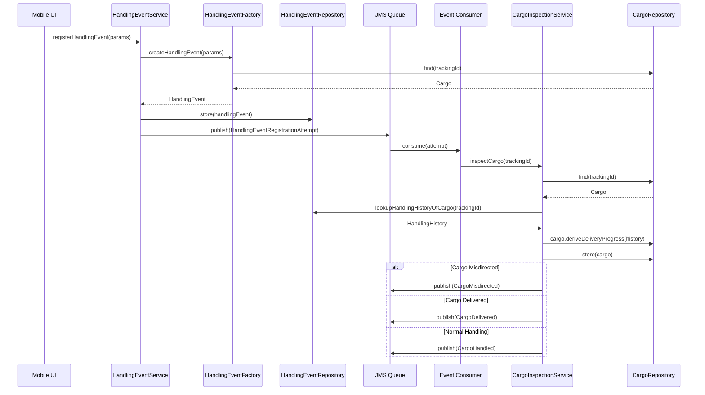

---

## Event Flow: Cargo Booking and Routing

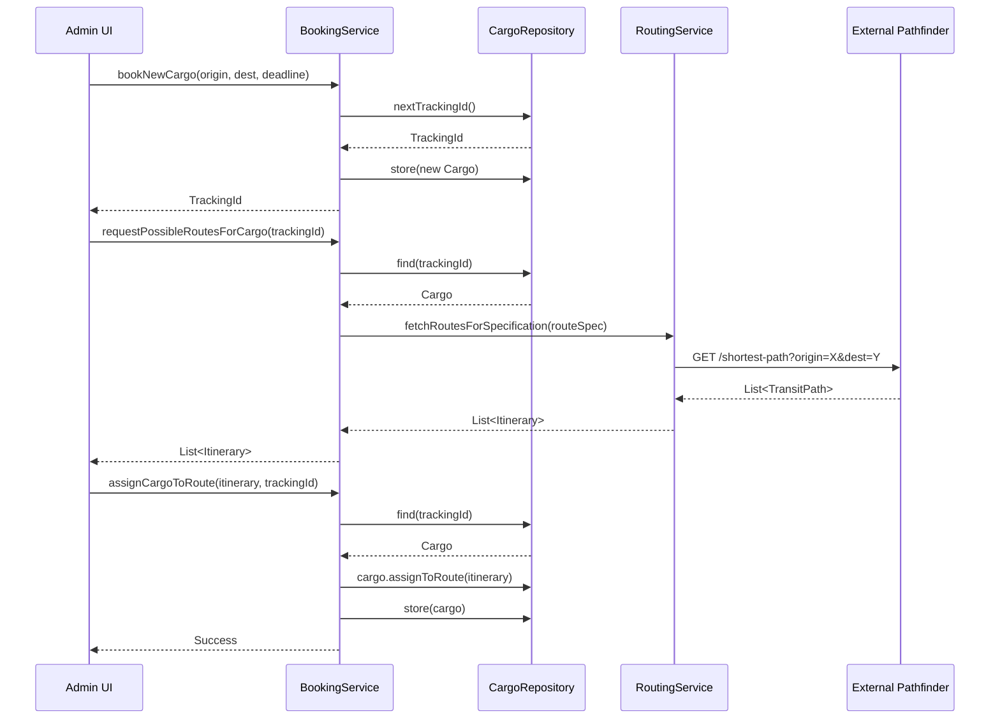

---

## Technology Stack

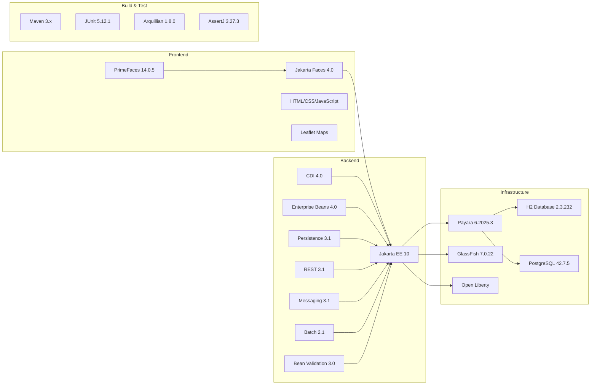

---

## Deployment Architecture

```mermaid
graph TB
    subgraph "Client Tier"
        BROWSER[Web Browser]
        MOBILE[Mobile Browser]
    end

    subgraph "Application Server"
        WAR[cargo-tracker.war]
        subgraph "Application Components"
            UI_LAYER[Presentation Layer]
            APP_LAYER[Application Layer]
            DOMAIN_LAYER[Domain Layer]
            INFRA_LAYER[Infrastructure Layer]
        end
    end

    subgraph "Data Tier"
        DB[(H2/PostgreSQL Database)]
        FILES[/tmp/uploads<br/>File System]
    end

    subgraph "External Services"
        PATHFINDER[Pathfinder<br/>Routing Service]
    end

    BROWSER --> WAR
    MOBILE --> WAR
    
    WAR --> UI_LAYER
    UI_LAYER --> APP_LAYER
    APP_LAYER --> DOMAIN_LAYER
    DOMAIN_LAYER --> INFRA_LAYER
    
    INFRA_LAYER --> DB
    INFRA_LAYER --> FILES
    INFRA_LAYER --> PATHFINDER
    
    style WAR fill:#4CAF50
    style DB fill:#2196F3
    style PATHFINDER fill:#FF9800
```

---

## Key Architectural Patterns

### 1. Domain-Driven Design (DDD)
- **Bounded Contexts**: Four clear contexts (Cargo, Handling, Location, Voyage)
- **Aggregates**: Each context has a clear aggregate root
- **Value Objects**: Immutable objects like TrackingId, UnLocode, VoyageNumber
- **Repositories**: Abstract data access
- **Domain Services**: RoutingService for cross-aggregate operations
- **Factories**: HandlingEventFactory, VoyageBuilder

### 2. Layered Architecture
- **Presentation**: JSF views, REST endpoints, SSE
- **Application**: Service facades, DTOs, assemblers
- **Domain**: Pure business logic, no infrastructure concerns
- **Infrastructure**: JPA, JMS, external service clients

### 3. Event-Driven Architecture
- **Async Processing**: JMS for handling events
- **Event Consumers**: Separate consumers for different event types
- **Eventual Consistency**: Cargo delivery status updated asynchronously

### 4. Hexagonal Architecture (Ports & Adapters)
- **Ports**: Repository interfaces, service interfaces
- **Adapters**: JPA implementations, JMS implementations, REST clients

---

## Data Model (Simplified)

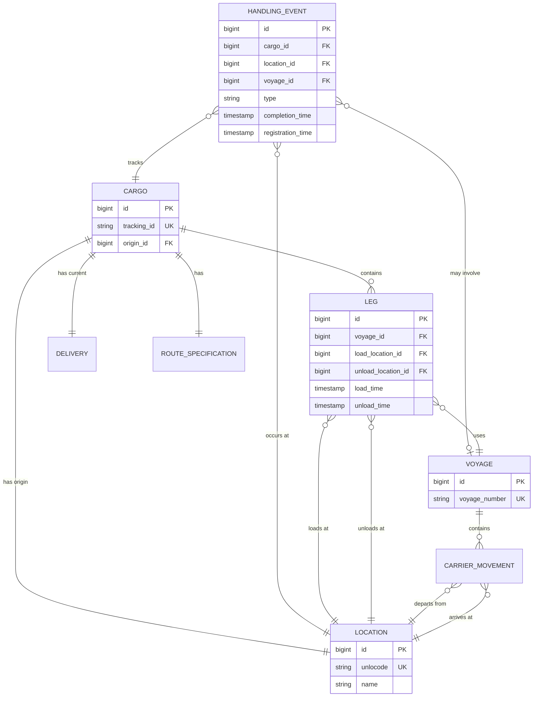

---

## Summary

### Strengths
1. **Clean DDD Implementation**: Clear bounded contexts with well-defined aggregates
2. **Separation of Concerns**: Layered architecture with minimal coupling
3. **Rich Domain Model**: Business logic encapsulated in domain objects
4. **Event-Driven**: Async processing for scalability
5. **Well-Tested**: Comprehensive test coverage with Arquillian

### Weaknesses
1. **Monolithic Deployment**: Single WAR file limits independent scaling
2. **Legacy UI Technology**: JSF/PrimeFaces harder to maintain than modern frameworks
3. **JMS Coupling**: Tight coupling to JMS for messaging
4. **File-Based Processing**: Not cloud-native or scalable
5. **No API Versioning**: REST endpoints lack versioning strategy

### Modernization Opportunities
1. **Microservices**: Decompose into separate services per bounded context
2. **Modern Frontend**: Replace JSF with React/Vue/Angular
3. **Cloud-Native Messaging**: Replace JMS with Kafka or cloud services
4. **API Gateway**: Add centralized API management
5. **Containerization**: Docker/Kubernetes deployment
6. **Observability**: Add distributed tracing, metrics, logging