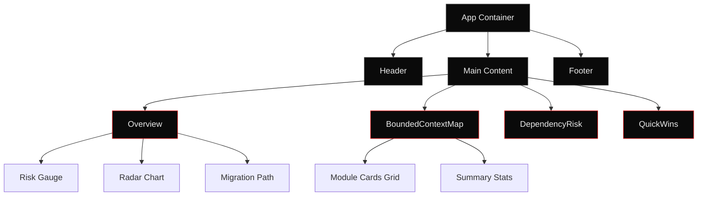

# Dashboard Redesign Plan: Industrial Brutalist Transformation

## Executive Summary

This document provides a comprehensive redesign plan to transform the LegacyLift Risk Analysis Dashboard from its current generic SaaS aesthetic into a cold, precise, terminal-like interface following strict industrial brutalist design principles. The redesign targets a **Tactical Telemetry & CRT Terminal** aesthetic appropriate for a technical developer tool analyzing legacy Java applications.

**Design Mode Selected:** Tactical Telemetry & CRT Terminal (Dark Mode)
**Rationale:** This is a data-heavy developer tool for analyzing cargo tracker modernization risks. The dark terminal aesthetic aligns with the technical, analytical nature of the application.

---

## 1. Design Principles Summary

### Core Industrial Brutalist Rules

1. **Typography as Infrastructure**
   - Monospace fonts dominate all data displays
   - Extreme scale contrast between structural headers and data
   - Uppercase exclusively for technical metadata
   - No Inter font - replaced with technical monospace

2. **Uncompromising Color System**
   - Dark mode only: `#0A0A0A` or `#121212` background
   - White phosphor text: `#EAEAEA`
   - Single accent: Aviation Red `#E61919` or `#FF2A2A`
   - Optional Terminal Green `#4AF626` for single specific element only
   - NO gradients, NO soft shadows, NO translucency

3. **Rigid Geometric Layout**
   - CSS Grid with visible compartmentalization
   - Solid borders (`1px` or `2px solid`) to delineate zones
   - Absolute rejection of `border-radius` - all 90-degree corners
   - Bimodal density: extreme data density vs vast negative space

4. **Utilitarian Components**
   - ASCII framing: `[ SYSTEM ]`, `< DATA >`, `>>>`, `///`
   - Technical symbols: `®`, `©`, `™` as structural elements
   - Crosshairs `+` at grid intersections
   - Randomized technical strings: `REV 2.6`, `UNIT / D-01`

5. **Analog Degradation Effects**
   - CRT scanlines via `repeating-linear-gradient`
   - Mechanical noise/grain overlay
   - Phosphor glow simulation (optional)

### Absolute Prohibitions

- ❌ NO emoji anywhere (🚀, 👋, ✨)
- ❌ NO gradient backgrounds or headers
- ❌ NO "Welcome to" text
- ❌ NO waving animations or bounce effects
- ❌ NO `rounded-xl` or `shadow-lg`
- ❌ NO colored card backgrounds
- ❌ NO Inter font
- ❌ NO soft, consumer-friendly UI patterns

---

## 2. Current State Analysis

### Violations Identified

#### [`Header.jsx`](dashboard/src/components/Header.jsx)
**Current Issues:**
- Line 5: `gradient-header` class uses gradient background
- Line 10: Rocket emoji `🚀` present
- Line 9: Uses generic font styling
- Line 5: `shadow-lg` shadow effect
- No monospace typography
- Soft, rounded aesthetic

#### [`Overview.jsx`](dashboard/src/components/Overview.jsx)
**Current Issues:**
- Line 56, 96: `rounded-lg` border radius
- Line 84-90: Pill-shaped badges with `rounded-full`
- Line 131: Gradient background `from-blue-50 to-purple-50`
- Line 137, 150: `rounded-lg` on version boxes
- Line 144, 146: Gradient arrows
- Charts use soft colors and rounded elements
- No monospace data display

#### [`BoundedContextMap.jsx`](dashboard/src/components/BoundedContextMap.jsx)
**Current Issues:**
- Line 47: `rounded-lg` border radius
- Line 47: `hover:shadow-lg` soft shadow
- Line 47: `hover:scale-105` bounce effect
- Line 75: `badge` class with rounded styling
- Colored card backgrounds (lines 48-51)
- No ASCII framing or technical symbology

#### [`App.jsx`](dashboard/src/App.jsx)
**Current Issues:**
- Line 10: `bg-gray-50` light background (should be dark)
- Line 22: `bg-gray-800` footer (inconsistent with brutalist dark)
- Generic spacing and layout

#### [`index.css`](dashboard/src/index.css)
**Current Issues:**
- Line 13: `.card` uses `rounded-lg` and `shadow-md`
- Line 17: `.badge` uses `rounded-full`
- Line 21: `.gradient-header` uses gradient
- No CRT effects, no scanlines, no noise overlay

#### [`tailwind.config.js`](dashboard/tailwind.config.js)
**Current Issues:**
- Line 17-18: IBM blue and purple colors (gradient colors)
- Missing monospace font configuration
- Missing industrial brutalist color palette
- No custom utilities for CRT effects

---

## 3. Design System Specifications

### 3.1 Typography System

#### Macro-Typography (Structural Headers)
```css
font-family: 'JetBrains Mono', 'IBM Plex Mono', 'Space Mono', monospace;
font-size: clamp(2rem, 5vw, 4rem);
font-weight: 700-900;
letter-spacing: -0.03em to -0.06em;
line-height: 0.85 to 0.95;
text-transform: uppercase;
```

**Tailwind Classes:**
```
font-mono text-4xl md:text-5xl lg:text-6xl font-black uppercase tracking-tighter leading-tight
```

#### Micro-Typography (Data & Telemetry)
```css
font-family: 'JetBrains Mono', 'IBM Plex Mono', monospace;
font-size: 0.7rem to 0.875rem (11px to 14px);
font-weight: 400-500;
letter-spacing: 0.05em to 0.1em;
line-height: 1.2 to 1.4;
text-transform: uppercase;
```

**Tailwind Classes:**
```
font-mono text-xs tracking-wide uppercase leading-tight
```

#### Body Text (Minimal Use)
```css
font-family: 'JetBrains Mono', monospace;
font-size: 0.875rem (14px);
font-weight: 400;
letter-spacing: 0.02em;
line-height: 1.5;
```

**Tailwind Classes:**
```
font-mono text-sm tracking-wide leading-relaxed
```

### 3.2 Color Palette: Tactical Telemetry (Dark)

#### Core Colors
```javascript
colors: {
  terminal: {
    bg: '#0A0A0A',        // Deactivated CRT background
    bgAlt: '#121212',     // Alternate background
    text: '#EAEAEA',      // White phosphor primary text
    textDim: '#666666',   // Dimmed text
    border: '#1A1A1A',    // Subtle borders
    borderStrong: '#333333', // Strong borders
  },
  hazard: {
    red: '#E61919',       // Aviation/Hazard Red (primary accent)
    redDim: '#8B0000',    // Dimmed red
  },
  status: {
    green: '#4AF626',     // Terminal Green (use sparingly)
    greenDim: '#2A7F15',  // Dimmed green
  },
  risk: {
    critical: '#E61919',  // Red
    high: '#FF6B35',      // Orange-red
    medium: '#FFB627',    // Amber
    low: '#4AF626',       // Green
  }
}
```

#### Usage Rules
- **Background:** Always `#0A0A0A` or `#121212`
- **Text:** Always `#EAEAEA` for primary content
- **Accent:** Use `#E61919` sparingly for alerts, dividers, critical data
- **Terminal Green:** Use ONLY for one specific element (e.g., "SYSTEM ONLINE" indicator)
- **Borders:** Use `#1A1A1A` for subtle compartmentalization, `#333333` for strong emphasis

### 3.3 Layout Structure

#### Grid System
```css
display: grid;
gap: 1px; /* Creates razor-thin dividing lines */
grid-template-columns: repeat(auto-fit, minmax(300px, 1fr));
```

#### Spacing Scale (Tailwind)
- `p-0`: No padding (for tight data)
- `p-2`: 8px (minimal spacing)
- `p-4`: 16px (standard module padding)
- `p-6`: 24px (section padding)
- `p-8`: 32px (major section padding)

#### Border System
```css
border: 1px solid #1A1A1A;  /* Subtle compartment */
border: 2px solid #333333;  /* Strong compartment */
border: 2px solid #E61919;  /* Critical/Alert */
```

**Tailwind Classes:**
```
border border-terminal-border
border-2 border-terminal-borderStrong
border-2 border-hazard-red
```

#### Container Constraints
```css
max-width: 1400px;
margin: 0 auto;
padding: 0 1rem;
```

**Tailwind Classes:**
```
max-w-7xl mx-auto px-4
```

### 3.4 CRT Effects & Post-Processing

#### Scanlines
```css
.scanlines {
  position: relative;
}

.scanlines::before {
  content: '';
  position: absolute;
  inset: 0;
  background: repeating-linear-gradient(
    0deg,
    transparent,
    transparent 2px,
    rgba(0, 0, 0, 0.15) 2px,
    rgba(0, 0, 0, 0.15) 4px
  );
  pointer-events: none;
  z-index: 1;
}
```

#### Noise Overlay
```css
.noise-overlay {
  position: fixed;
  inset: 0;
  background-image: url("data:image/svg+xml,%3Csvg viewBox='0 0 200 200' xmlns='http://www.w3.org/2000/svg'%3E%3Cfilter id='noise'%3E%3CfeTurbulence type='fractalNoise' baseFrequency='0.9' numOctaves='4' /%3E%3C/filter%3E%3Crect width='100%25' height='100%25' filter='url(%23noise)' opacity='0.05'/%3E%3C/svg%3E");
  pointer-events: none;
  z-index: 9999;
}
```

---

## 4. Component-by-Component Redesign Specifications

### 4.1 Header Component

#### Current State
- Gradient background (`gradient-header`)
- Rocket emoji
- Soft shadows
- Generic typography
- Blue/purple color scheme

#### Proposed Changes

**Structure:**
```jsx
<header className="border-b-2 border-terminal-borderStrong bg-terminal-bg">
  <div className="max-w-7xl mx-auto px-4 py-4">
    <div className="grid grid-cols-1 md:grid-cols-3 gap-4 items-center">
      {/* Left: System ID */}
      <div className="font-mono text-xs tracking-widest uppercase text-terminal-textDim">
        [ SYSTEM / LEGACYLIFT ]
      </div>
      
      {/* Center: Main Title */}
      <div className="text-center">
        <h1 className="font-mono text-2xl md:text-3xl font-black uppercase tracking-tighter text-terminal-text">
          RISK ANALYSIS
        </h1>
        <div className="font-mono text-xs tracking-wide uppercase text-terminal-textDim mt-1">
          CARGO TRACKER / MODERNIZATION
        </div>
      </div>
      
      {/* Right: Metadata */}
      <div className="font-mono text-xs tracking-wide uppercase text-terminal-textDim text-right">
        <div>REV 2.6</div>
        <div className="text-hazard-red">{new Date().toISOString().split('T')[0]}</div>
      </div>
    </div>
  </div>
</header>
```

**Key Changes:**
- Remove gradient, use solid `bg-terminal-bg`
- Remove emoji completely
- Replace with ASCII framing `[ SYSTEM / LEGACYLIFT ]`
- All text in monospace, uppercase
- Strong border bottom `border-b-2`
- Technical metadata: `REV 2.6`, ISO date format
- Grid layout for precise alignment

**Exact Tailwind Classes:**
```
Header container: border-b-2 border-terminal-borderStrong bg-terminal-bg
Inner container: max-w-7xl mx-auto px-4 py-4
Grid: grid grid-cols-1 md:grid-cols-3 gap-4 items-center
System ID: font-mono text-xs tracking-widest uppercase text-terminal-textDim
Title: font-mono text-2xl md:text-3xl font-black uppercase tracking-tighter text-terminal-text
Subtitle: font-mono text-xs tracking-wide uppercase text-terminal-textDim mt-1
Metadata: font-mono text-xs tracking-wide uppercase text-terminal-textDim text-right
Date: text-hazard-red
```

### 4.2 Overview Component

#### Current State
- Rounded cards (`rounded-lg`)
- Soft backgrounds (`bg-gray-50`)
- Gradient migration path section
- Rounded badges
- Soft chart styling

#### Proposed Changes

**Structure:**
```jsx
<div className="border-2 border-terminal-borderStrong bg-terminal-bg p-6">
  {/* Section Header */}
  <div className="border-b border-terminal-border pb-4 mb-6">
    <h2 className="font-mono text-xl font-bold uppercase tracking-tight text-terminal-text">
      /// OVERVIEW
    </h2>
  </div>
  
  <div className="grid grid-cols-1 lg:grid-cols-2 gap-1 bg-terminal-border">
    {/* Risk Gauge - Left Panel */}
    <div className="bg-terminal-bg p-6">
      <div className="font-mono text-xs tracking-widest uppercase text-terminal-textDim mb-4">
        [ OVERALL RISK SCORE ]
      </div>
      {/* Chart here */}
      <div className="text-center mt-4">
        <div className="font-mono text-6xl font-black text-hazard-red">
          {riskScore}
        </div>
        <div className="font-mono text-xs tracking-wide uppercase text-terminal-textDim mt-2">
          / 100 MAXIMUM
        </div>
        <div className="font-mono text-xs tracking-widest uppercase text-hazard-red mt-2 border border-hazard-red px-2 py-1 inline-block">
          {getGaugeLabel(riskScore)}
        </div>
      </div>
    </div>
    
    {/* Radar Chart - Right Panel */}
    <div className="bg-terminal-bg p-6">
      <div className="font-mono text-xs tracking-widest uppercase text-terminal-textDim mb-4">
        [ RISK CATEGORIES ]
      </div>
      {/* Chart here */}
      <div className="grid grid-cols-2 gap-2 mt-4 font-mono text-xs">
        {radarData.map((item) => (
          <div key={item.category} className="flex justify-between border border-terminal-border p-2">
            <span className="text-terminal-textDim uppercase tracking-wide">{item.category}:</span>
            <span className="text-terminal-text font-bold">{item.value}</span>
          </div>
        ))}
      </div>
    </div>
  </div>
  
  {/* Java Migration Path */}
  <div className="mt-6 border-2 border-hazard-red bg-terminal-bg p-6">
    <div className="font-mono text-xs tracking-widest uppercase text-terminal-textDim mb-4 text-center">
      [ JAVA VERSION MIGRATION PATH ]
    </div>
    <div className="flex items-center justify-center gap-8">
      <div className="text-center">
        <div className="border-2 border-hazard-red bg-terminal-bg px-6 py-4">
          <div className="font-mono text-3xl font-black text-hazard-red">JAVA 11</div>
          <div className="font-mono text-xs tracking-widest uppercase text-hazard-red mt-2">
            CURRENT / EOL
          </div>
        </div>
      </div>
      
      <div className="font-mono text-2xl text-terminal-textDim">
        >>> >>> >>>
      </div>
      
      <div className="text-center">
        <div className="border-2 border-status-green bg-terminal-bg px-6 py-4">
          <div className="font-mono text-3xl font-black text-status-green">JAVA 21</div>
          <div className="font-mono text-xs tracking-widest uppercase text-status-green mt-2">
            TARGET / LTS
          </div>
        </div>
      </div>
    </div>
    <div className="font-mono text-xs tracking-wide uppercase text-terminal-textDim text-center mt-4">
      MIGRATION REQUIRED: JAVA 11 EOL SEPTEMBER 2023
    </div>
  </div>
</div>
```

**Key Changes:**
- Remove all `rounded-lg`, use sharp corners
- Replace gradient with solid borders
- Use `gap-1` with contrasting backgrounds for grid dividers
- ASCII directional arrows `>>> >>> >>>`
- Square brackets for section labels `[ LABEL ]`
- Monospace everywhere
- Risk score in massive font size
- Replace gradient arrows with ASCII
- Strong border emphasis with `border-2`

**Exact Tailwind Classes:**
```
Container: border-2 border-terminal-borderStrong bg-terminal-bg p-6
Section header: border-b border-terminal-border pb-4 mb-6
Title: font-mono text-xl font-bold uppercase tracking-tight text-terminal-text
Grid: grid grid-cols-1 lg:grid-cols-2 gap-1 bg-terminal-border
Panel: bg-terminal-bg p-6
Label: font-mono text-xs tracking-widest uppercase text-terminal-textDim mb-4
Score: font-mono text-6xl font-black text-hazard-red
Badge: font-mono text-xs tracking-widest uppercase text-hazard-red mt-2 border border-hazard-red px-2 py-1 inline-block
Data row: flex justify-between border border-terminal-border p-2
Migration box: border-2 border-hazard-red bg-terminal-bg p-6
Version box: border-2 border-hazard-red bg-terminal-bg px-6 py-4
Version text: font-mono text-3xl font-black text-hazard-red
Arrows: font-mono text-2xl text-terminal-textDim
```

### 4.3 BoundedContextMap Component

#### Current State
- Rounded cards with hover scale
- Colored backgrounds
- Soft shadows
- Pill badges
- Generic card grid

#### Proposed Changes

**Structure:**
```jsx
<div className="border-2 border-terminal-borderStrong bg-terminal-bg p-6">
  {/* Section Header */}
  <div className="border-b border-terminal-border pb-4 mb-6 flex justify-between items-center">
    <h2 className="font-mono text-xl font-bold uppercase tracking-tight text-terminal-text">
      /// BOUNDED CONTEXT RISK MAP
    </h2>
    <div className="font-mono text-xs tracking-widest uppercase text-terminal-textDim">
      {recommendations.length} MODULES ANALYZED
    </div>
  </div>
  
  <div className="grid grid-cols-1 md:grid-cols-2 lg:grid-cols-3 gap-1 bg-terminal-border">
    {recommendations.map((module, index) => {
      const borderColor = getRiskBorderColor(module.risk_score);
      
      return (
        <div
          key={index}
          className="bg-terminal-bg p-5 border-l-4"
          style={{ borderLeftColor: borderColor }}
        >
          {/* Module Header */}
          <div className="border-b border-terminal-border pb-3 mb-3">
            <div className="font-mono text-xs tracking-widest uppercase text-terminal-textDim mb-2">
              [ MODULE / {String(index + 1).padStart(2, '0')} ]
            </div>
            <h3 className="font-mono text-base font-bold uppercase tracking-tight text-terminal-text">
              {module.bounded_context}
            </h3>
          </div>
          
          {/* Risk Score */}
          <div className="flex items-baseline gap-3 mb-3">
            <div className="font-mono text-4xl font-black" style={{ color: borderColor }}>
              {module.risk_score}
            </div>
            <div className="font-mono text-xs tracking-wide uppercase text-terminal-textDim">
              / 100 RISK
            </div>
          </div>
          
          {/* Impact Badge */}
          <div className="mb-3">
            <span className="font-mono text-xs tracking-widest uppercase border px-2 py-1 inline-block"
                  style={{ borderColor: borderColor, color: borderColor }}>
              {getImpactLabel(module.impact)} IMPACT
            </span>
          </div>
          
          {/* Effort */}
          <div className="mb-4 font-mono text-xs tracking-wide uppercase">
            <span className="text-terminal-textDim">UPGRADE EFFORT:</span>
            <span className="text-terminal-text font-bold ml-2">{module.upgrade_effort_days} DAYS</span>
          </div>
          
          {/* Concerns */}
          <div>
            <div className="font-mono text-xs tracking-widest uppercase text-terminal-textDim mb-2">
              TOP CONCERNS:
            </div>
            <ul className="space-y-1">
              {module.reasons.slice(0, 2).map((reason, idx) => (
                <li key={idx} className="font-mono text-xs text-terminal-text flex items-start gap-2">
                  <span className="text-hazard-red">+</span>
                  <span className="flex-1">{reason}</span>
                </li>
              ))}
            </ul>
            {module.reasons.length > 2 && (
              <div className="font-mono text-xs text-terminal-textDim mt-2">
                +{module.reasons.length - 2} MORE CONCERNS
              </div>
            )}
          </div>
        </div>
      );
    })}
  </div>
  
  {/* Summary Stats */}
  <div className="mt-6 pt-6 border-t-2 border-terminal-borderStrong">
    <div className="grid grid-cols-2 md:grid-cols-4 gap-1 bg-terminal-border">
      <div className="bg-terminal-bg p-4 text-center">
        <div className="font-mono text-3xl font-black text-hazard-red">
          {recommendations.filter(m => m.risk_score >= 75).length}
        </div>
        <div className="font-mono text-xs tracking-widest uppercase text-terminal-textDim mt-1">
          CRITICAL
        </div>
      </div>
      <div className="bg-terminal-bg p-4 text-center">
        <div className="font-mono text-3xl font-black text-risk-high">
          {recommendations.filter(m => m.risk_score >= 60 && m.risk_score < 75).length}
        </div>
        <div className="font-mono text-xs tracking-widest uppercase text-terminal-textDim mt-1">
          HIGH
        </div>
      </div>
      <div className="bg-terminal-bg p-4 text-center">
        <div className="font-mono text-3xl font-black text-risk-medium">
          {recommendations.filter(m => m.risk_score >= 40 && m.risk_score < 60).length}
        </div>
        <div className="font-mono text-xs tracking-widest uppercase text-terminal-textDim mt-1">
          MEDIUM
        </div>
      </div>
      <div className="bg-terminal-bg p-4 text-center">
        <div className="font-mono text-3xl font-black text-status-green">
          {recommendations.filter(m => m.risk_score < 40).length}
        </div>
        <div className="font-mono text-xs tracking-widest uppercase text-terminal-textDim mt-1">
          LOW
        </div>
      </div>
    </div>
  </div>
</div>
```

**Key Changes:**
- Remove all rounded corners
- Remove hover scale effect
- Remove colored backgrounds, use left border accent instead
- Replace pill badges with square bordered badges
- Use `gap-1` grid technique for dividers
- ASCII framing: `[ MODULE / 01 ]`
- Crosshair bullets: `+` instead of `•`
- Monospace everywhere
- Strong border emphasis

**Exact Tailwind Classes:**
```
Container: border-2 border-terminal-borderStrong bg-terminal-bg p-6
Header: border-b border-terminal-border pb-4 mb-6 flex justify-between items-center
Title: font-mono text-xl font-bold uppercase tracking-tight text-terminal-text
Count: font-mono text-xs tracking-widest uppercase text-terminal-textDim
Grid: grid grid-cols-1 md:grid-cols-2 lg:grid-cols-3 gap-1 bg-terminal-border
Card: bg-terminal-bg p-5 border-l-4
Module label: font-mono text-xs tracking-widest uppercase text-terminal-textDim mb-2
Module name: font-mono text-base font-bold uppercase tracking-tight text-terminal-text
Score: font-mono text-4xl font-black
Badge: font-mono text-xs tracking-widest uppercase border px-2 py-1 inline-block
Effort: font-mono text-xs tracking-wide uppercase
Concerns title: font-mono text-xs tracking-widest uppercase text-terminal-textDim mb-2
Concern item: font-mono text-xs text-terminal-text flex items-start gap-2
Bullet: text-hazard-red
Stats grid: grid grid-cols-2 md:grid-cols-4 gap-1 bg-terminal-border
Stat box: bg-terminal-bg p-4 text-center
Stat number: font-mono text-3xl font-black
Stat label: font-mono text-xs tracking-widest uppercase text-terminal-textDim mt-1
```

### 4.4 App Component & Footer

#### Current State
- Light background (`bg-gray-50`)
- Generic footer with gradient
- Soft spacing

#### Proposed Changes

**Structure:**
```jsx
<div className="min-h-screen bg-terminal-bg scanlines">
  <div className="noise-overlay"></div>
  
  <Header />
  
  <main className="max-w-7xl mx-auto px-4 py-8">
    <div className="space-y-1 bg-terminal-border">
      <Overview />
      <BoundedContextMap />
      <DependencyRisk />
      <QuickWins />
    </div>
  </main>
  
  <footer className="border-t-2 border-terminal-borderStrong bg-terminal-bg py-6 mt-12">
    <div className="max-w-7xl mx-auto px-4">
      <div className="grid grid-cols-1 md:grid-cols-3 gap-4 font-mono text-xs tracking-widest uppercase">
        <div className="text-terminal-textDim">
          [ SYSTEM / LEGACYLIFT ]
        </div>
        <div className="text-center text-terminal-text">
          RISK ANALYSIS ENGINE
        </div>
        <div className="text-right text-terminal-textDim">
          POWERED BY IBM BOB
        </div>
      </div>
      <div className="font-mono text-xs tracking-wide uppercase text-terminal-textDim text-center mt-4">
        ECLIPSE CARGO TRACKER / MODERNIZATION ASSESSMENT
      </div>
    </div>
  </footer>
</div>
```

**Key Changes:**
- Dark background throughout
- Add scanlines effect
- Add noise overlay
- Use `space-y-1` with border background for section dividers
- Footer with strong top border
- Grid layout for footer content
- All monospace, uppercase

**Exact Tailwind Classes:**
```
Root: min-h-screen bg-terminal-bg scanlines
Main: max-w-7xl mx-auto px-4 py-8
Sections: space-y-1 bg-terminal-border
Footer: border-t-2 border-terminal-borderStrong bg-terminal-bg py-6 mt-12
Footer grid: grid grid-cols-1 md:grid-cols-3 gap-4 font-mono text-xs tracking-widest uppercase
Footer text: text-terminal-textDim, text-terminal-text
```

---

## 5. Implementation Guidelines

### 5.1 Tailwind Configuration Updates

**File:** [`dashboard/tailwind.config.js`](dashboard/tailwind.config.js)

```javascript
/** @type {import('tailwindcss').Config} */
export default {
  content: [
    "./index.html",
    "./src/**/*.{js,ts,jsx,tsx}",
  ],
  theme: {
    extend: {
      colors: {
        terminal: {
          bg: '#0A0A0A',
          bgAlt: '#121212',
          text: '#EAEAEA',
          textDim: '#666666',
          border: '#1A1A1A',
          borderStrong: '#333333',
        },
        hazard: {
          red: '#E61919',
          redDim: '#8B0000',
        },
        status: {
          green: '#4AF626',
          greenDim: '#2A7F15',
        },
        risk: {
          critical: '#E61919',
          high: '#FF6B35',
          medium: '#FFB627',
          low: '#4AF626',
        }
      },
      fontFamily: {
        mono: ['JetBrains Mono', 'IBM Plex Mono', 'Space Mono', 'Courier New', 'monospace'],
      },
      letterSpacing: {
        tighter: '-0.05em',
        widest: '0.15em',
      }
    },
  },
  plugins: [],
}
```

### 5.2 Global CSS Updates

**File:** [`dashboard/src/index.css`](dashboard/src/index.css)

```css
@tailwind base;
@tailwind components;
@tailwind utilities;

@layer base {
  body {
    @apply bg-terminal-bg text-terminal-text font-mono;
  }
}

@layer components {
  /* Remove old card and badge classes */
  
  /* CRT Scanlines Effect */
  .scanlines {
    position: relative;
  }
  
  .scanlines::before {
    content: '';
    position: absolute;
    inset: 0;
    background: repeating-linear-gradient(
      0deg,
      transparent,
      transparent 2px,
      rgba(0, 0, 0, 0.15) 2px,
      rgba(0, 0, 0, 0.15) 4px
    );
    pointer-events: none;
    z-index: 1;
  }
  
  /* Noise Overlay */
  .noise-overlay {
    position: fixed;
    inset: 0;
    background-image: url("data:image/svg+xml,%3Csvg viewBox='0 0 200 200' xmlns='http://www.w3.org/2000/svg'%3E%3Cfilter id='noise'%3E%3CfeTurbulence type='fractalNoise' baseFrequency='0.9' numOctaves='4' /%3E%3C/filter%3E%3Crect width='100%25' height='100%25' filter='url(%23noise)' opacity='0.05'/%3E%3C/svg%3E");
    pointer-events: none;
    z-index: 9999;
  }
}

@layer utilities {
  /* Optional: Phosphor glow effect for specific elements */
  .phosphor-glow {
    text-shadow: 0 0 5px currentColor, 0 0 10px currentColor;
  }
}
```

### 5.3 Helper Function Updates

**File:** [`dashboard/src/utils/helpers.js`](dashboard/src/utils/helpers.js)

Update color helper functions to return industrial brutalist colors:

```javascript
export function getRiskBorderColor(score) {
  if (score >= 75) return '#E61919'; // Critical - Hazard Red
  if (score >= 60) return '#FF6B35'; // High - Orange-red
  if (score >= 40) return '#FFB627'; // Medium - Amber
  return '#4AF626'; // Low - Terminal Green
}

export function getGaugeColor(score) {
  return getRiskBorderColor(score);
}

export function getGaugeLabel(score) {
  if (score >= 75) return 'CRITICAL';
  if (score >= 60) return 'HIGH';
  if (score >= 40) return 'MEDIUM';
  return 'LOW';
}

export function getImpactLabel(impact) {
  return impact.toUpperCase();
}
```

### 5.4 Chart Styling Updates

For Recharts components, apply these style overrides:

```javascript
// Dark theme for charts
const chartTheme = {
  background: '#0A0A0A',
  text: '#EAEAEA',
  grid: '#1A1A1A',
  accent: '#E61919',
};

// Apply to RadialBarChart
<RadialBarChart>
  <RadialBar
    background={{ fill: '#121212' }}
    dataKey="value"
    cornerRadius={0} // No rounded corners
  />
</RadialBarChart>

// Apply to RadarChart
<RadarChart>
  <PolarGrid stroke="#1A1A1A" />
  <PolarAngleAxis 
    tick={{ fill: '#EAEAEA', fontSize: 10, fontFamily: 'monospace' }}
  />
  <PolarRadiusAxis 
    tick={{ fill: '#666666', fontSize: 9, fontFamily: 'monospace' }}
  />
  <Radar
    stroke="#E61919"
    fill="#E61919"
    fillOpacity={0.3}
  />
</RadarChart>
```

### 5.5 Implementation Order

1. **Phase 1: Foundation** (Day 1)
   - Update [`tailwind.config.js`](dashboard/tailwind.config.js) with new color palette and fonts
   - Update [`index.css`](dashboard/src/index.css) with CRT effects
   - Update helper functions in [`helpers.js`](dashboard/src/utils/helpers.js)

2. **Phase 2: Layout** (Day 1-2)
   - Update [`App.jsx`](dashboard/src/App.jsx) with dark background and effects
   - Implement grid-based section dividers

3. **Phase 3: Components** (Day 2-3)
   - Redesign [`Header.jsx`](dashboard/src/components/Header.jsx)
   - Redesign [`Overview.jsx`](dashboard/src/components/Overview.jsx)
   - Redesign [`BoundedContextMap.jsx`](dashboard/src/components/BoundedContextMap.jsx)
   - Update remaining components (DependencyRisk, QuickWins)

4. **Phase 4: Polish** (Day 3)
   - Fine-tune spacing and alignment
   - Test all interactive states
   - Verify no prohibited elements remain
   - Add ASCII framing and technical symbology

### 5.6 Testing Checklist

Before considering the redesign complete, verify:

- [ ] No emoji anywhere in the application
- [ ] No gradient backgrounds or headers
- [ ] No rounded corners (`rounded-*` classes removed)
- [ ] No soft shadows (`shadow-*` classes removed)
- [ ] All text uses monospace font
- [ ] All backgrounds are `#0A0A0A` or `#121212`
- [ ] All text is `#EAEAEA` or `#666666`
- [ ] Accent color `#E61919` used sparingly
- [ ] Terminal green `#4AF626` used for maximum one element
- [ ] All borders are sharp 90-degree angles
- [ ] ASCII framing present: `[ ]`, `< >`, `///`, `>>>`
- [ ] Scanlines effect visible
- [ ] Noise overlay present
- [ ] Grid-based layout with visible compartmentalization
- [ ] All uppercase for technical metadata
- [ ] No "Welcome to" text
- [ ] No waving animations

---

## 6. Design Rationale

### Why Tactical Telemetry?

The LegacyLift Risk Analysis Dashboard is a **technical developer tool** for analyzing legacy Java application modernization. The data-heavy, analytical nature of this application demands:

1. **High Information Density:** Monospace fonts and tight spacing maximize data display
2. **Technical Credibility:** Terminal aesthetic signals serious engineering tool
3. **Focus on Data:** Dark mode reduces eye strain during extended analysis sessions
4. **Professional Authority:** Industrial brutalism conveys precision and expertise

### Target User Experience

The redesigned interface should feel like:
- A classified military database terminal
- An aerospace mission control display
- A legacy mainframe system interface
- Linear's issue tracker meets a CRT terminal

**NOT like:**
- A consumer SaaS product
- A marketing landing page
- A friendly onboarding experience
- A colorful dashboard

### Visual Hierarchy

1. **Primary:** Risk scores and critical data (large monospace numbers)
2. **Secondary:** Module names and section headers (uppercase monospace)
3. **Tertiary:** Metadata and labels (small uppercase monospace)
4. **Accent:** Hazard red for critical alerts and structural emphasis

---

## 7. Mermaid Diagram: Component Structure



---

## 8. Key Design Decisions Summary

### Typography
- **Primary Font:** JetBrains Mono (monospace)
- **Fallbacks:** IBM Plex Mono, Space Mono, Courier New
- **Scale:** Extreme contrast from 0.7rem to 4rem
- **Treatment:** Uppercase for all technical metadata, tight tracking for headers

### Color Palette
- **Mode:** Tactical Telemetry (Dark)
- **Background:** `#0A0A0A` (Deactivated CRT)
- **Text:** `#EAEAEA` (White Phosphor)
- **Accent:** `#E61919` (Aviation Red)
- **Optional:** `#4AF626` (Terminal Green) for single element only

### Layout Principles
- **Grid-based:** CSS Grid with `gap-1` for razor-thin dividers
- **Compartmentalization:** Solid borders delineate all zones
- **No Rounding:** All corners exactly 90 degrees
- **Bimodal Density:** Tight data clusters vs vast negative space

### Major Component Changes
1. **Header:** Remove gradient and emoji, add ASCII framing and technical metadata
2. **Overview:** Replace rounded cards with bordered panels, ASCII arrows for migration path
3. **BoundedContextMap:** Left-border accent instead of colored backgrounds, square badges
4. **Global:** Add CRT scanlines and noise overlay effects

---

## Conclusion

This redesign plan transforms the dashboard from a generic SaaS interface into a cold, precise, terminal-like developer tool. Every design decision reinforces the technical, analytical nature of the application while maintaining full functionality. The industrial brutalist aesthetic establishes authority and credibility appropriate for a professional modernization risk analysis platform.

**Implementation Time Estimate:** 3 days
**Risk Level:** Low (CSS/styling changes only, no functionality changes)
**Impact:** High (complete visual transformation)